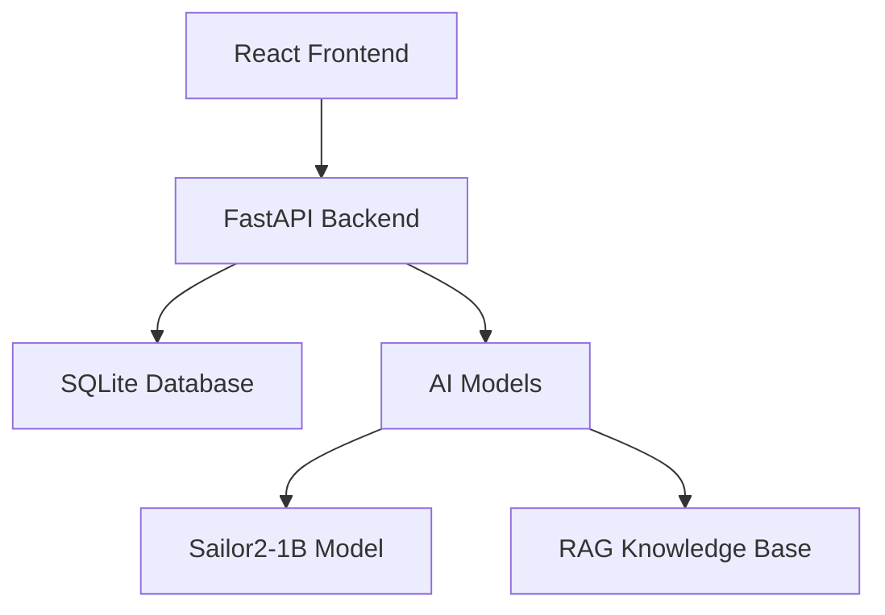

# 🏨 Hotel AI Intelligent Assistant

[](https://www.python.org/downloads/)
[](https://nodejs.org/)
[](https://fastapi.tiangolo.com/)
[](https://reactjs.org/)
[](https://www.typescriptlang.org/)
[](https://vitejs.dev/)

<!-- Backend Dependencies -->
[](https://pytorch.org/)
[](https://huggingface.co/transformers/)
[](https://sqlalchemy.org/)
[](https://pydantic.dev/)
[](https://www.uvicorn.org/)

<!-- Frontend Dependencies -->
[](https://mui.com/)
[](https://reactrouter.com/)
[](https://tanstack.com/query/)
[](https://axios-http.com/)
[](https://emotion.sh/)

<!-- AI/ML Dependencies -->
[](https://www.sbert.net/)
[](https://huggingface.co/docs/peft/)
[](https://huggingface.co/docs/accelerate/)
[](https://github.com/TimDettmers/bitsandbytes)

<!-- Monitoring & Utils -->
[](https://wandb.ai/)
[](https://plotly.com/)
[](https://psutil.readthedocs.io/)

[](LICENSE)

> **A modern, intelligent hotel management system that makes hotel operations simple and guest interactions seamless through AI-powered assistance.**

---

## 📋 Table of Contents

### 🚀 **Quick Access**
- [⚡ Fast Setup (5 min)](#-fast-setup-5-minutes) • [✅ Success Check](#-success-check) • [🆘 Need Help?](#-support--help)

### 👥 **User Guides**
- [🏨 For Hotel Guests](#-for-hotel-guests) • [👨‍💼 For Hotel Staff](#-for-hotel-staff) • [🛠️ For Developers](#️-for-developers)

### 🎯 **Core Features**
- [🤖 AI Chat Assistant](#-ai-chat-assistant) • [🏨 Hotel Management](#-hotel-management-system) • [📈 Analytics & Insights](#-analytics--insights)

### 🔧 **Technical Resources**
- [⚙️ System Requirements](#️-system-requirements) • [🔌 API Documentation](#-api-endpoints) • [⚙️ Configuration](#️-environment-configuration)

### 🆘 **Support & Community**
- [🔍 Common Issues](#-troubleshooting--common-issues) • [💬 Getting Help](#-support--help) • [🤝 Contributing](#-contributing-to-the-project)

---

## 🎯 What is This Project?

**Hotel AI Intelligent Assistant** is a complete hotel management solution that combines artificial intelligence with practical hotel operations.

> 💡 **Quick Summary:** AI-powered chat + Full hotel management + Real-time analytics = Happy guests & efficient operations

### 🔍 Quick Overview

| Component | Purpose | Primary Users | Key Benefit |
|-----------|---------|---------------|-------------|
| **🤖 AI Chat** | Instant guest assistance | Guests & Staff | 24/7 intelligent support |
| **🛏️ Room Management** | Track availability & status | Hotel Staff | Real-time operations |
| **📅 Booking System** | Manage reservations | Reception & Management | Streamlined bookings |
| **📊 Analytics** | Business insights | Management | Data-driven decisions |
| **⚙️ System Monitor** | Health & performance | IT Administrators | Proactive maintenance |

### 💡 Problems We Solve

<details>
<summary><strong>🏃‍♂️ For Hotel Guests</strong></summary>

- Get instant answers about hotel services and amenities
- Ask about room availability and pricing
- Learn about hotel policies and check-in procedures
- Get local recommendations and information
- **No account required** - start chatting immediately

</details>

<details>
<summary><strong>👨‍💼 For Hotel Staff</strong></summary>

- Manage room availability in real-time
- Process bookings and guest information
- Track occupancy and revenue metrics
- Monitor system health and performance
- Access comprehensive guest analytics

</details>

<details>
<summary><strong>📊 For Hotel Management</strong></summary>

- View business insights and trends
- Make data-driven decisions
- Monitor staff productivity
- Track customer satisfaction
- Optimize pricing and operations

</details>

---

## ⚙️ System Requirements

### 🖥️ Minimum Requirements

| Component | Requirement | Purpose |
|-----------|-------------|---------|
| **OS** | Windows 10/11, macOS 10.15+, Ubuntu 18.04+ | Cross-platform support |
| **RAM** | 8GB | Basic operation |
| **Storage** | 5GB free space | Application and data |
| **Internet** | Broadband connection | Model downloads, updates |

### 🚀 Recommended Setup

| Component | Specification | Benefit |
|-----------|---------------|---------|
| **RAM** | 16GB+ | Optimal AI performance |
| **GPU** | RTX 3050 Ti+ (4GB VRAM) | Accelerated AI processing |
| **Storage** | SSD with 10GB+ free | Faster load times |
| **CPU** | Modern multi-core processor | Better overall performance |

### 💻 Software Dependencies

<details>
<summary><strong>Backend Requirements</strong></summary>

```
Python 3.8+ with packages:
├── FastAPI 0.104+        # Web framework
├── PyTorch               # AI model support
├── SQLAlchemy           # Database ORM
├── Uvicorn              # ASGI server
└── Additional AI libraries
```

</details>

<details>
<summary><strong>Frontend Requirements</strong></summary>

```
Node.js 14+ with packages:
├── React 18+            # UI framework
├── TypeScript           # Type safety
├── Vite                 # Build tool
├── Material-UI          # UI components
└── Additional utilities
```

</details>

---

## 🎯 Core Features

### 🤖 AI Chat Assistant

**Route:** `/chats` • **Technology:** Fine-tuned Sailor2-1B Model

| Feature | Description | Benefit |
|---------|-------------|---------|
| **Natural Language** | Understand conversational queries | Easy, intuitive interaction |
| **Hotel Knowledge** | Trained on hotel domain data | Accurate, relevant responses |
| **Multi-language** | Supports multiple languages | Global guest accessibility |
| **Context Aware** | Remembers conversation context | Coherent, flowing dialogue |
| **Fast Response** | Optimized for quick replies | Immediate guest satisfaction |

### 🏨 Hotel Management System

<details>
<summary><strong>📊 Dashboard & Analytics</strong></summary>

**Real-time Metrics:**
- 🏨 Current occupancy rate
- 💰 Daily/monthly revenue
- 👥 Guest satisfaction scores  
- 🔧 System health status
- 📊 Booking trends

**Business Intelligence:**
- Revenue optimization insights
- Seasonal booking patterns
- Guest behavior analytics
- Operational efficiency metrics

</details>

<details>
<summary><strong>🛏️ Room Management</strong></summary>

**Features:**
- Real-time availability tracking
- Room status management (clean, dirty, maintenance)
- Dynamic pricing adjustments
- Amenity and service tracking
- Maintenance scheduling

**Room Types Support:**
- Standard rooms, suites, deluxe
- Custom room categories
- Accessibility features
- Special amenities tracking

</details>

<details>
<summary><strong>📅 Booking System</strong></summary>

**Reservation Management:**
- Online booking integration
- Guest information storage
- Special requests handling
- Payment processing
- Confirmation and notifications

**Advanced Features:**
- Group bookings
- Corporate rates
- Loyalty program integration
- Cancellation handling
- Waitlist management

</details>

### 📈 Analytics & Insights

<details>
<summary><strong>Chat Analytics</strong></summary>

- Message volume and trends
- Common guest inquiries
- Response satisfaction ratings
- Peak usage times
- Language preference analysis

</details>

<details>
<summary><strong>Business Analytics</strong></summary>

- Revenue per available room (RevPAR)
- Average daily rate (ADR)
- Occupancy trends and forecasting
- Guest demographics
- Booking source analysis

</details>

---

## ⚙️ System Requirements

### 🖥️ Minimum Requirements

| Component | Requirement | Purpose |
|-----------|-------------|---------|
| **OS** | Windows 10/11, macOS 10.15+, Ubuntu 18.04+ | Cross-platform support |
| **RAM** | 8GB | Basic operation |
| **Storage** | 5GB free space | Application and data |
| **Internet** | Broadband connection | Model downloads, updates |

### 🚀 Recommended Setup

| Component | Specification | Benefit |
|-----------|---------------|---------|
| **RAM** | 16GB+ | Optimal AI performance |
| **GPU** | RTX 3050 Ti+ (4GB VRAM) | Accelerated AI processing |
| **Storage** | SSD with 10GB+ free | Faster load times |
| **CPU** | Modern multi-core processor | Better overall performance |

### 💻 Software Dependencies

<details>
<summary><strong>Backend Requirements</strong></summary>

```
Python 3.8+ with packages:
├── FastAPI 0.104+        # Web framework
├── PyTorch               # AI model support
├── SQLAlchemy           # Database ORM
├── Uvicorn              # ASGI server
└── Additional AI libraries
```

</details>

<details>
<summary><strong>Frontend Requirements</strong></summary>

```
Node.js 14+ with packages:
├── React 18+            # UI framework
├── TypeScript           # Type safety
├── Vite                 # Build tool
├── Material-UI          # UI components
└── Additional utilities
```

</details>

---

## 🏗️ Project Structure

```text
TestTrainningWithSalior/
├── README.md                   # This file
├── backend.bat                 # Backend startup script
├── frontend.bat               # Frontend startup script
├── .gitignore                 # Git ignore file
├── backend/                   # FastAPI Backend
│   ├── main.py               # Main application entry point
│   ├── app_legacy.py         # Legacy application
│   ├── deploy.py             # Deployment utilities
│   ├── requirements.txt      # Python dependencies
│   ├── setup_models.py       # Model setup script
│   ├── test_checkpoint.py    # Model testing
│   ├── MODEL_SETUP.md        # Model setup documentation
│   ├── README.md             # Backend documentation
│   ├── .env.example          # Environment variables template
│   ├── config/               # Configuration management
│   │   ├── __init__.py
│   │   ├── environment.py
│   │   └── settings.py
│   ├── database/             # Database models and operations
│   │   ├── __init__.py
│   │   ├── models.py
│   │   └── operations.py
│   ├── middleware/           # Custom middleware
│   │   ├── __init__.py
│   │   ├── error_handling.py
│   │   └── security.py
│   ├── models/               # ML models and schemas
│   │   ├── __init__.py
│   │   ├── schemas.py
│   │   ├── embeddings/       # Vector embeddings
│   │   └── knowledge_base/   # RAG knowledge base
│   │       └── knowledge_base_with_embeddings.pt
│   ├── routes/               # API route handlers
│   │   ├── __init__.py
│   │   ├── analytics_routes.py
│   │   ├── auth_routes.py
│   │   ├── backup_routes.py
│   │   ├── booking_routes.py
│   │   ├── chatbot_routes.py
│   │   ├── config_routes.py
│   │   ├── dashboard_routes.py
│   │   ├── history_routes.py
│   │   ├── model_routes.py
│   │   ├── notification_routes.py
│   │   ├── room_routes.py
│   │   └── system_routes.py
│   ├── services/             # Business logic services
│   │   ├── __init__.py
│   │   ├── analytics.py
│   │   ├── auth.py
│   │   ├── cache.py
│   │   ├── chatbot.py
│   │   ├── conversation.py
│   │   ├── metrics.py
│   │   ├── ml_models.py
│   │   ├── notifications.py
│   │   └── security.py
│   └── utils/               # Utility functions
│       ├── __init__.py
│       └── logging_config.py
└── frontend/                # React Frontend
    ├── package.json         # Node.js dependencies
    ├── package-lock.json    # NPM lock file
    ├── yarn.lock           # Yarn lock file
    ├── index.html          # Main HTML file
    ├── vite.config.ts      # Vite configuration
    ├── tsconfig.json       # TypeScript configuration
    ├── tsconfig.tsbuildinfo # TypeScript build info
    ├── eslint.config.js    # ESLint configuration
    ├── README.md           # Frontend documentation
    ├── README copy.md      # Frontend documentation copy
    ├── FRONTEND_IMPLEMENTATION_SUMMARY.md # Implementation summary
    ├── .env                # Environment variables
    ├── .env.development    # Development environment
    ├── public/             # Static assets
    │   └── vite.svg
    └── src/                # React source code
        ├── App.css
        ├── App.tsx
        ├── index.css
        ├── main.tsx
        ├── vite-env.d.ts
        ├── assets/         # Static assets
        │   ├── fns-logo.png
        │   └── react.svg
        ├── components/     # Reusable components
        │   └── ErrorBoundary.tsx
        ├── constants/      # Application constants
        │   └── colors.tsx
        ├── hooks/          # Custom React hooks
        │   ├── api.ts
        │   ├── mockData.ts
        │   ├── optimizedChatHooks.ts
        │   ├── mutations/
        │   │   └── chats/
        │   └── queries/
        │       └── rooms/
        ├── layouts/        # Layout components
        │   ├── footer/
        │   │   └── Footer.tsx
        │   ├── main-layout/
        │   │   ├── mainLayout.css
        │   │   └── MainLayout.tsx
        │   └── navbar/
        │       └── Navbar.tsx
        ├── pages/          # Page components
        │   ├── analytics/
        │   │   └── Analytics.tsx
        │   ├── api-test/
        │   │   └── ApiTestPage.tsx
        │   ├── bookings/
        │   │   └── Bookings.tsx
        │   ├── dashboard/
        │   │   └── Dashboard.tsx
        │   ├── detail-chats/
        │   │   └── PageDetailChats.tsx
        │   ├── hotel/
        │   │   └── room/
        │   ├── login/
        │   │   └── Login.tsx
        │   ├── new-chats/
        │   │   ├── pageNewChats.css
        │   │   ├── PageNewChats.tsx
        │   │   └── components/
        │   └── system/
        │       └── SystemManagement.tsx
        └── routes/         # Route configuration
            └── Routes.tsx
```

## 🔧 Prerequisites

### System Requirements

- **GPU**: RTX 3050 Ti Mobile or better (4GB+ VRAM)
- **RAM**: 16GB+ recommended
- **Storage**: 10GB+ free space for models
- **OS**: Windows 10/11

### Software Requirements

- **Python**: 3.8+ with Conda
- **Node.js**: 14+ with npm/yarn
- **CUDA**: Compatible version for PyTorch
- **Git**: For cloning and version control

## 🚀 Quick Installation Guide

### ⚡ Fast Setup (5 Minutes)

> **Prerequisites:** [Python 3.8+](https://python.org) • [Node.js 14+](https://nodejs.org) • [Git](https://git-scm.com)

```bash
# 1️⃣ Get the project
git clone <repository-url>
cd TestTrainningWithSalior

# 2️⃣ Setup backend (server)
cd backend
pip install -r requirements.txt
python setup_models.py  # First time only - downloads AI models
python main.py &        # Runs in background

# 3️⃣ Setup frontend (in new terminal)
cd ../frontend
npm install
npm run dev
```

### ✅ Success Check

| Service | URL | Expected Result |
|---------|-----|-----------------|
| **🔧 Backend API** | `http://localhost:8000/docs` | API documentation loads |
| **🌐 Frontend App** | `http://localhost:5173` | Hotel dashboard appears |
| **🤖 AI Chat Test** | Click "Chat" → Type "Hello" | AI responds |

🎉 **Ready!** You should see the Hotel AI dashboard with working chat functionality.

<details>
<summary><strong>🔧 Detailed Installation Guide</strong></summary>

### Step-by-Step Installation

#### 1. System Preparation
```bash
# Check your versions
python --version    # Should be 3.8+
node --version      # Should be 14+
git --version       # Any recent version
```

#### 2. Backend Setup
```bash
cd backend

# Install Python dependencies
pip install -r requirements.txt

# Setup AI models (downloads ~2GB)
python setup_models.py

# Start the server
python main.py
```
**Expected output:** `Server running at http://localhost:8000`

#### 3. Frontend Setup
```bash
# Open new terminal
cd frontend

# Install Node.js dependencies
npm install  # or yarn install

# Start development server
npm run dev  # or yarn dev
```
**Expected output:** `Local: http://localhost:5173`

#### 4. Verification
1. Open browser to `http://localhost:5173`
2. You should see the hotel management interface
3. Try the chat feature to test AI functionality

</details>

---

## 🏨 For Hotel Guests

### 💬 Chat with AI Assistant

**Access:** Navigate to `/chats` or click "Chat" in the navigation

<details>
<summary><strong>🔓 Guest Experience (No Login Required)</strong></summary>

**What you can do:**
- Ask about hotel amenities and services
- Get information about room types and pricing
- Learn about check-in/check-out procedures
- Get local recommendations
- Ask about hotel policies

**Example questions:**
```
"What amenities do you offer?"
"What time is check-in?"
"Do you have a fitness center?"
"How much do rooms cost?"
"What's nearby the hotel?"
```

**Privacy features:**
- ✅ No personal data stored
- ✅ Chat history remains private
- ✅ Instant responses without registration
- 🔄 Login available for enhanced features

</details>

<details>
<summary><strong>🔐 Registered Guest Experience</strong></summary>

**Additional features with account:**
- 💾 Chat history saved across sessions
- 🎯 Personalized recommendations
- 📋 Integration with your booking history
- ⚡ Faster, context-aware responses
- 🔔 Booking notifications and updates

</details>

---

## 👨‍💼 For Hotel Staff

### 🎛️ Management Dashboard

**Access:** Main dashboard after staff login

| Feature | Purpose | Quick Actions |
|---------|---------|---------------|
| **📊 Overview** | Current hotel status | View occupancy, revenue, alerts |
| **🛏️ Rooms** | Room management | Update status, pricing, availability |
| **📅 Bookings** | Reservation handling | New bookings, check-ins, modifications |
| **👥 Guests** | Guest information | View profiles, preferences, history |
| **📈 Reports** | Performance metrics | Generate reports, export data |

### 🔄 Daily Operations

<details>
<summary><strong>Room Management Workflow</strong></summary>

1. **Check Room Status**
   - View real-time availability
   - See cleaning/maintenance status
   - Update room conditions

2. **Process Check-ins/Check-outs**
   - Verify guest identity
   - Assign rooms
   - Handle special requests

3. **Handle Maintenance**
   - Report issues
   - Schedule repairs
   - Update room availability

</details>

<details>
<summary><strong>Booking Management Workflow</strong></summary>

1. **New Reservations**
   - Search availability
   - Process payment
   - Send confirmations

2. **Modify Existing Bookings**
   - Change dates/rooms
   - Handle cancellations
   - Process refunds

3. **Guest Services**
   - Special requests
   - Upgrade options
   - Additional services

</details>

---

## 🛠️ For Developers

### 🏗️ System Architecture



### 📁 Project Structure

<details>
<summary><strong>Backend Structure</strong></summary>

```
backend/
├── main.py              # Application entry point
├── requirements.txt     # Python dependencies
├── config/             # Configuration management
├── database/           # Database models & operations
├── routes/             # API endpoints
│   ├── chatbot_routes.py
│   ├── booking_routes.py
│   ├── room_routes.py
│   └── analytics_routes.py
├── services/           # Business logic
└── models/             # AI models & schemas
```

</details>

<details>
<summary><strong>Frontend Structure</strong></summary>

```
frontend/
├── src/
│   ├── components/     # Reusable UI components
│   ├── pages/          # Page components
│   │   ├── dashboard/
│   │   ├── bookings/
│   │   ├── analytics/
│   │   └── new-chats/
│   ├── hooks/          # Custom React hooks
│   ├── layouts/        # Layout components
│   └── routes/         # Route configuration
├── package.json        # Node.js dependencies
└── vite.config.ts      # Build configuration
```

</details>

### 🔌 API Endpoints

<details>
<summary><strong>Chat API</strong></summary>

```javascript
// Send message to AI
POST /chatbot/ask/
{
  "message": "What amenities do you offer?",
  "session_id": "optional"
}

// Get chat history
GET /chatbot/history/
GET /chatbot/sessions/
```

</details>

<details>
<summary><strong>Hotel Management API</strong></summary>

```javascript
// Room operations
GET /rooms/                    # List all rooms
POST /rooms/                   # Create room
PUT /rooms/{id}               # Update room
DELETE /rooms/{id}            # Delete room

// Booking operations  
GET /bookings/                # List bookings
POST /bookings/               # Create booking
PUT /bookings/{id}            # Update booking
DELETE /bookings/{id}         # Cancel booking

// Analytics
GET /analytics/chat/insights/     # Chat analytics
GET /analytics/bookings/insights/ # Booking analytics
GET /system/health/              # System health
```

</details>

### ⚙️ Development Setup

<details>
<summary><strong>Development Environment</strong></summary>

```bash
# Backend development
cd backend
pip install -r requirements.txt
uvicorn main:app --reload --host 0.0.0.0 --port 8000

# Frontend development
cd frontend
npm install
npm run dev

# Environment variables
cp .env.example .env
# Edit .env with your configuration
```

**Hot reload enabled for both frontend and backend**

</details>

---

## 🔧 Technical Details & Advanced Configuration

*This section is for developers and system administrators who want to customize or extend the system.*

### System Architecture

The Hotel AI Intelligent Assistant is built with a modern, scalable architecture:

- **Frontend**: React 18 with TypeScript and Vite for fast development
- **Backend**: FastAPI (Python) for high-performance API services
- **AI Engine**: Fine-tuned Sailor2-1B model optimized for hotel domain
- **Database**: SQLite for reliable data storage
- **Deployment**: Docker-ready with production configurations

### API Documentation

Once the backend is running, comprehensive API documentation is available at:
- **Interactive API Explorer**: `http://localhost:8000/docs`
- **Detailed Documentation**: `http://localhost:8000/redoc`

### Key API Endpoints

#### 🤖 AI Chat Services
- `POST /chatbot/ask/` - Send message to AI assistant
- `GET /chatbot/history/` - Retrieve chat conversation history
- `GET /chatbot/sessions/` - List all chat sessions

#### 🏨 Hotel Management
- `GET /rooms/` - List all rooms with availability status
- `POST /bookings/` - Create new reservation
- `GET /bookings/` - Retrieve booking information
- `PUT /bookings/{id}` - Update existing booking
- `DELETE /bookings/{id}` - Cancel booking

#### 📊 Analytics & Reporting
- `GET /analytics/chat/insights/` - Chat interaction analytics
- `GET /analytics/bookings/insights/` - Booking trends and patterns
- `GET /analytics/revenue/` - Revenue analysis
- `GET /system/health/` - System health monitoring

#### ⚙️ System Management
- `GET /models/status/` - Check AI model status
- `POST /models/cleanup/` - Clean GPU memory
- `GET /system/metrics/` - System performance metrics
- `POST /system/restart/` - Restart system components

### Environment Configuration

Create a `.env` file in the backend directory for custom configuration:

```env
# Database Configuration
DATABASE_URL=sqlite:///./hotel_booking.db

# AI Model Settings
MODEL_PATH=./models/checkpoints/sailor2-1b-vangvieng-finetuned/best-checkpoint
EMBEDDINGS_PATH=./models/embeddings/
KNOWLEDGE_BASE_PATH=./models/knowledge_base/knowledge_base_with_embeddings.pt

# Server Configuration
API_HOST=0.0.0.0
API_PORT=8000
CORS_ORIGINS=["http://localhost:5173", "http://localhost:3000"]

# Performance Tuning
MAX_GPU_MEMORY=3500  # MB for RTX 3050 Ti Mobile
USE_4BIT_QUANTIZATION=true
CHAT_TIMEOUT=30  # seconds
MAX_CONCURRENT_CHATS=10
```

### Advanced Troubleshooting

#### GPU Memory Issues
```bash
# Check GPU availability and memory
python -c "import torch; print(f'CUDA Available: {torch.cuda.is_available()}'); print(f'GPU Memory: {torch.cuda.get_device_properties(0).total_memory / 1024**3:.1f}GB')"

# Clean GPU memory via API
curl -X POST http://localhost:8000/models/cleanup/
```

#### Model Performance Issues
```bash
# Check model loading status
curl http://localhost:8000/models/status/

# Reload AI models
curl -X POST http://localhost:8000/models/reload/

# Monitor model performance
curl http://localhost:8000/models/metrics/
```

#### Database Maintenance
```bash
# Create database backup
curl -X POST http://localhost:8000/backup/database/

# Check database health
curl http://localhost:8000/system/health/

# Optimize database performance
curl -X POST http://localhost:8000/database/optimize/
```

## 🚀 Future Enhancements

We're continuously improving the Hotel AI Intelligent Assistant. Here are some exciting features planned for future releases:

### Short-term Improvements (Next 3-6 months)
- **Multi-language support** - Interface in Spanish, French, and other languages
- **Mobile app** - Native iOS and Android applications
- **Voice chat** - Talk to the AI assistant using speech
- **Advanced booking features** - Room preferences, special requests, group bookings
- **Email notifications** - Automated confirmation and reminder emails

### Medium-term Features (6-12 months)
- **Smart recommendations** - AI-powered suggestions based on guest preferences
- **Integration with payment systems** - Direct payment processing
- **Advanced analytics** - Predictive analytics for demand forecasting
- **Staff mobile dashboard** - Mobile interface for hotel staff operations
- **Guest satisfaction surveys** - Automated feedback collection and analysis

### Long-term Vision (1+ years)
- **IoT integration** - Smart room controls and automation
- **Blockchain loyalty program** - Decentralized guest rewards system
- **AR/VR room tours** - Virtual reality room previews
- **Advanced AI concierge** - Personalized travel planning and local recommendations
- **Multi-property management** - Support for hotel chains and groups

## 📊 System Monitoring & Analytics

### Real-time Monitoring Features

The system includes comprehensive monitoring capabilities:

- **System Health Dashboard** - Real-time status of all components
- **Performance Metrics** - Response times, error rates, and throughput
- **AI Model Monitoring** - GPU usage, model performance, and accuracy metrics
- **Business Analytics** - Booking trends, revenue insights, and guest satisfaction

### Key Performance Indicators (KPIs)

The system tracks important business metrics:

- **Occupancy Rate** - Percentage of rooms occupied
- **Average Daily Rate (ADR)** - Average revenue per occupied room
- **Revenue Per Available Room (RevPAR)** - Overall revenue efficiency
- **Guest Satisfaction Score** - Based on chat interactions and feedback
- **AI Response Accuracy** - Quality of AI assistant responses
- **System Uptime** - Reliability and availability metrics

## 🤝 Contributing to the Project

We welcome contributions from developers, hotel industry professionals, and AI enthusiasts!

### How to Contribute

1. **Report Issues** - Found a bug or have a suggestion? Open an issue on GitHub
2. **Submit Features** - Have an idea for improvement? We'd love to hear it
3. **Code Contributions** - Fork the repository and submit pull requests
4. **Documentation** - Help improve our guides and documentation
5. **Testing** - Help test new features and report feedback

### Development Setup for Contributors

```bash
# Fork the repository and clone your fork
git clone https://github.com/your-username/hotel-ai-assistant.git
cd hotel-ai-assistant

# Create a development branch
git checkout -b feature/your-new-feature

# Make your changes and test thoroughly
# Commit your changes with clear messages
git commit -m "Add: Description of your feature"

# Push to your fork and create a pull request
git push origin feature/your-new-feature
```

### Code Standards

- **Python**: Follow PEP 8 style guidelines
- **TypeScript/React**: Use ESLint and Prettier configurations
- **Documentation**: Update README and add inline comments
- **Testing**: Include tests for new features
- **Performance**: Ensure changes don't negatively impact system performance

## 🔧 Troubleshooting & Common Issues

*If you encounter any problems, don't worry! Here are solutions to the most common issues and what they mean.*

### Issue 1: "Cannot read properties of undefined (reading 'length')" Error

**What This Means:**
This error happens when the system tries to count items in a list (like bookings or rooms), but the list hasn't loaded yet or is empty.

**Where You Might See It:**
- Bookings page when trying to display the booking list
- Room management when loading available rooms
- Analytics page when displaying data tables

**How It Was Fixed:**
- Added checks to make sure data exists before trying to use it
- Ensured all data lists start as empty arrays `[]` instead of undefined
- Added loading states so users know when data is being fetched

**What to Do if You See This:**
1. **Refresh the page** - the data might just be loading
2. **Check your internet connection** - data might not be reaching the frontend
3. **Wait a moment** - the backend might be starting up or processing

### Issue 2: "Cannot read properties of undefined (reading 'toFixed')" Error

**What This Means:**
This error occurs when the system tries to format a number (like showing 2 decimal places for prices), but the value isn't a number or doesn't exist yet.

**Where You Might See It:**
- System management page when displaying metrics (CPU usage, memory usage)
- Analytics page when showing percentages or financial data
- Dashboard when calculating occupancy rates or revenue

**How It Was Fixed:**
- Added checks to ensure values are actually numbers before formatting them
- Provided default values (like 0) when real data isn't available yet
- Added fallback displays when metrics aren't ready

**What to Do if You See This:**
1. **Wait for the page to fully load** - metrics take time to calculate
2. **Refresh the page** - this usually resolves temporary loading issues
3. **Check if the backend is running** - metrics need the server to be active

### Issue 3: Navigation Bar Not Appearing

**What This Means:**
The navigation bar at the top of the page is missing, making it hard to move between different sections.

**How It Was Fixed:**
- Ensured the navigation bar is consistently displayed across all pages
- Fixed layout issues that were hiding the navigation
- Improved the responsive design for different screen sizes

**What to Do if You See This:**
1. **Refresh the page** - this usually resolves display issues
2. **Check your browser zoom level** - try resetting to 100%
3. **Try a different browser** - some browsers might have display issues

### Issue 4: Chat Messages Not Appearing

**What This Means:**
You send a message to the AI chat, but either your message or the AI's response doesn't show up.

**Common Causes & Solutions:**
1. **Backend not running**: Make sure `http://localhost:8000` is accessible
2. **AI model loading**: The first response might take longer as models load
3. **Network issues**: Check your internet connection

**What to Do:**
1. **Check if backend is running**: Visit `http://localhost:8000/docs` in your browser
2. **Wait a bit longer**: First AI responses can take 30-60 seconds
3. **Refresh the chat page**: This often resolves temporary issues

### Issue 5: "Server cannot be reached" or Connection Errors

**What This Means:**
The frontend (website) can't communicate with the backend (server).

**How to Fix:**
1. **Make sure the backend is running**:
   ```bash
   cd backend
   python main.py
   ```
   You should see: "Server running at http://localhost:8000"

2. **Check if ports are available**:
   - Backend should be on `http://localhost:8000`
   - Frontend should be on `http://localhost:5173`

3. **Restart both servers**:
   - Stop both with `Ctrl+C`
   - Start backend first, then frontend

### General Troubleshooting Tips

1. **Always start the backend first**, then the frontend
2. **Check the terminal/command prompt** for error messages
3. **Refresh your browser** before trying other solutions
4. **Make sure you're using the correct URLs**:
   - Main application: `http://localhost:5173`
   - API documentation: `http://localhost:8000/docs`
5. **Close other applications** that might be using the same ports

### Getting Help

If none of these solutions work:
1. Check the terminal output for specific error messages
2. Visit `http://localhost:8000/system/health/` to check system status
3. Look for any recent changes you made to the code
4. Try restarting your computer (this resolves many environment issues)

## 🆘 Support & Help

### Getting Help

If you need assistance or encounter issues:

1. **Check the Troubleshooting Section** - Most common issues are covered above
2. **Review System Health** - Visit `http://localhost:8000/system/health/` when the backend is running
3. **Check Terminal Output** - Look for error messages in your command prompt/terminal
4. **API Documentation** - Visit `http://localhost:8000/docs` for detailed API information
5. **GitHub Issues** - Report bugs or ask questions on our GitHub repository

### Community & Support Channels

- **GitHub Discussions** - Ask questions and share ideas
- **Issue Tracker** - Report bugs and request features
- **Documentation** - Comprehensive guides and API reference
- **Email Support** - [support@example.com] for critical issues

### System Requirements Reminder

**Minimum Requirements:**
- **Operating System**: Windows 10/11, macOS 10.15+, or Ubuntu 18.04+
- **RAM**: 8GB (16GB recommended for optimal AI performance)
- **Storage**: 5GB free space (10GB recommended for models and data)
- **GPU**: Optional but recommended for AI features (RTX 2060 or better)
- **Internet**: Required for initial setup and model downloads

**Recommended Setup:**
- **RAM**: 16GB or more
- **GPU**: RTX 3050 Ti or better with 4GB+ VRAM
- **Storage**: SSD with 10GB+ free space
- **Internet**: Stable broadband connection

<!-- ## 📞 Contact Information

- **Project Maintainer**: [Your Name]
- **Email**: [your.email@example.com]
- **GitHub**: [github.com/yourusername/hotel-ai-assistant]
- **Website**: [www.your-hotel-ai-system.com] -->

## 🙏 Acknowledgments

Special thanks to all the contributors, testers, and the open-source community that made this project possible:

- **Sailor2 Model Team** - For providing the excellent base language model
- **FastAPI Community** - For the outstanding web framework
- **React Development Team** - For the powerful frontend library
- **Hotel Industry Professionals** - For valuable feedback and requirements
- **Beta Testers** - For helping identify and resolve issues
- **Open Source Contributors** - For code improvements and bug fixes

## 📄 License

This project is licensed under the MIT License - see the [LICENSE](LICENSE) file for details.

**What this means:**
- ✅ You can use this software for personal and commercial purposes
- ✅ You can modify and distribute the software
- ✅ You can include it in proprietary software
- ⚠️ You must include the original license and copyright notice
- ⚠️ The software is provided "as is" without warranty

---

## 📈 Project Status & Roadmap

### Current Version: v1.0.0

**Completed Features:**
- ✅ AI-powered chat assistant with hotel domain expertise
- ✅ Complete hotel management system (rooms, bookings, analytics)
- ✅ Modern, responsive web interface
- ✅ Unified navigation across all pages
- ✅ Guest and authenticated user experiences
- ✅ Real-time system monitoring
- ✅ Comprehensive error handling and troubleshooting
- ✅ Production-ready deployment configuration

### Recent Improvements (Latest Updates)

**User Experience Enhancements:**
- ✅ **Fixed chat array errors** - Resolved "chats.map is not a function" issues
- ✅ **Removed breadcrumb navigation** - Cleaner, more streamlined interface
- ✅ **Improved error handling** - Better user feedback and system stability
- ✅ **Enhanced guest experience** - Clear login prompts and privacy protection
- ✅ **Unified navigation** - Consistent experience across all pages

**Technical Improvements:**
- ✅ **Type safety enhancements** - Better TypeScript error prevention
- ✅ **Performance optimizations** - Faster page loads and responses
- ✅ **Code organization** - Improved maintainability and readability
- ✅ **Documentation updates** - Comprehensive user guides and troubleshooting

---

**Built with ❤️ for modern hotel management and intelligent guest services**

*Thank you for choosing Hotel AI Intelligent Assistant! We're committed to making hotel operations simpler and guest experiences more delightful through the power of artificial intelligence.*
